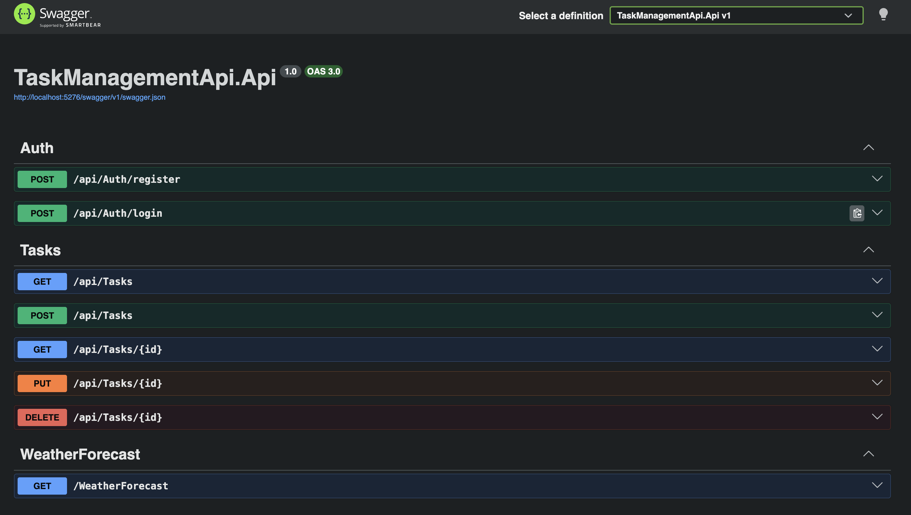
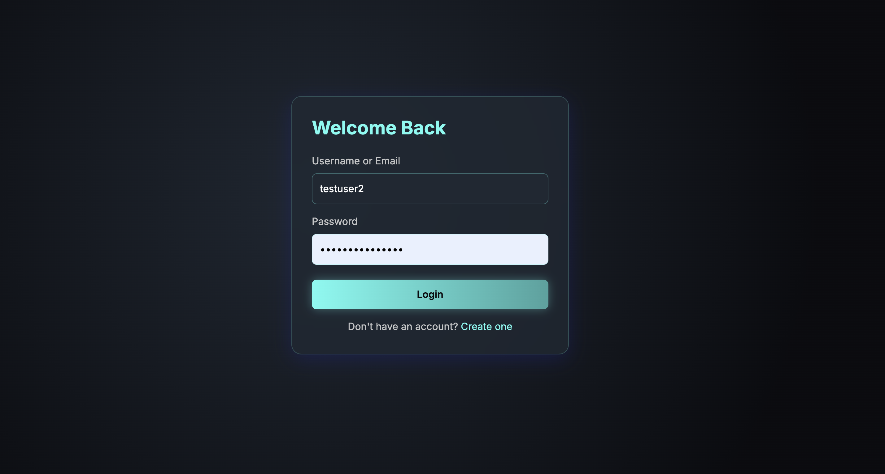
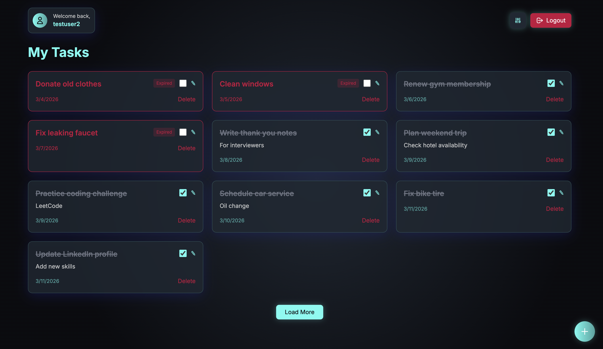
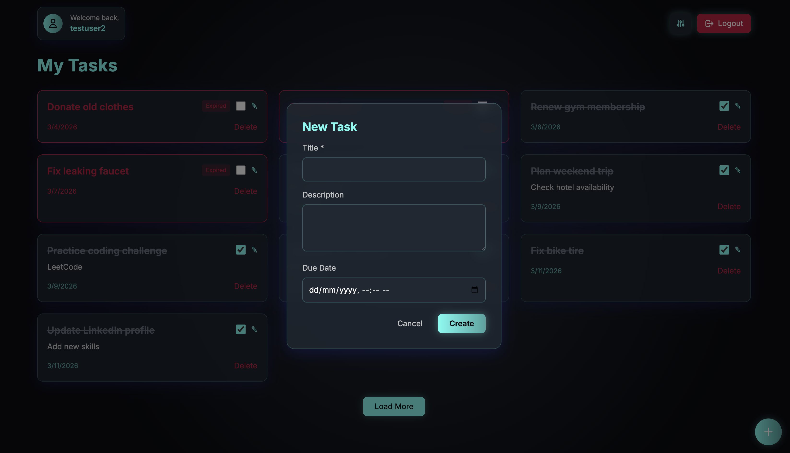
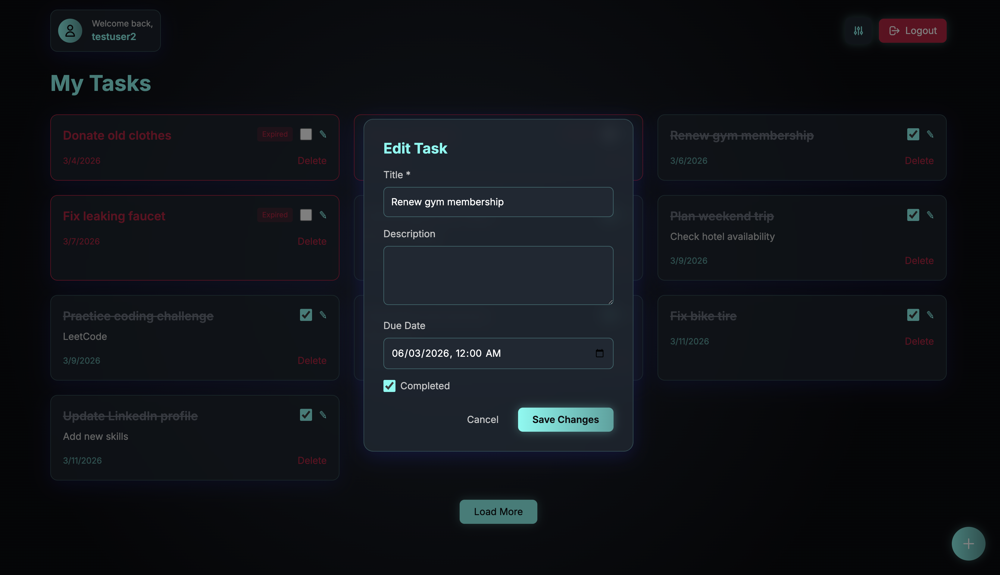

# 🚀 Task Management System

A full-stack task management application with a strong focus on **backend architecture, API design, and production-ready practices**.

Built using **ASP.NET Core Web API** and **React (Vite)**, this project demonstrates how to design and implement a scalable backend with authentication, validation, filtering, and structured layering.

---

## 🎯 Overview

This project was designed to showcase **real-world backend development practices**, including:

- Clean layered architecture  
- Secure authentication using JWT  
- Robust validation and error handling  
- Scalable API design with pagination, filtering, and sorting  

The frontend serves as a **lightweight client** to interact with and demonstrate the backend capabilities.

---

## 🧠 Key Backend Features

### 🔐 Authentication & Security
- JWT-based authentication with claims
- Secure password hashing using BCrypt
- Protected endpoints using `[Authorize]`
- User-specific data access (no cross-user leakage)

---

### 🏗️ Architecture & Design
- Clean separation of concerns:
    - Repository pattern with generic and specific repositories
    - DTO-based API design
    - Dependency Injection throughout the application

---

### 📊 Task Management API
- Full CRUD operations for tasks
- Each task linked to an authenticated user
- Supports partial updates

---

### ⚙️ Advanced API Capabilities
- **Pagination** (pageNumber, pageSize)
- **Filtering**:
- Completion status
- Expired tasks
- Due date range
- **Sorting**:
- By due date or creation date
- Ascending / descending order

---

### ✅ Validation & Error Handling
- FluentValidation for request validation
- Custom business exceptions (`NotFoundException`, `DuplicateException`)
- Global exception handling middleware
- Consistent and clean API responses

---

## 🎨 Frontend (Supporting Layer)

A lightweight React frontend built to demonstrate API usage and interaction.

Features:
- Authentication flow (login/register)
- Task CRUD operations
- Pagination UI with "Load More"
- Filtering & sorting controls
- Responsive glass-morphic design
- Axios-based API integration

Code Quality:
- ESLint for consistent code standards
- Prettier for formatting and readability

> Note: The frontend is intentionally kept simple — the primary focus of this project is backend engineering.

---

---

## 🛠️ Tech Stack

### Backend
- ASP.NET Core Web API (.NET 8/9)
- Entity Framework Core (SQLite)
- JWT Authentication
- BCrypt
- FluentValidation

### Frontend
- React (Vite)
- Tailwind CSS
- Axios
- Framer Motion

---

## 🧪 Highlights

- Designed with **production-style architecture**
- Implements **secure authentication and user isolation**
- Demonstrates **scalable API design patterns**
- Covers **real-world backend concerns** (validation, error handling, filtering)
- Maintains code quality using **ESLint and Prettier**

---

## 📌 Future Improvements

- Refresh token implementation
- Docker containerization
- Deployment to cloud (Azure / Render)
- Unit and integration testing

---

## 📷 Preview
API ENDPOINTS

LOGIN USER
 

TASK ITEMS
 

CREATE NEW TASK
 

TASK UPDATE

---

## 💡 Key Takeaway

This project focuses on building a **clean, scalable, and maintainable backend system**, with the frontend acting as a demonstration layer for API capabilities.
